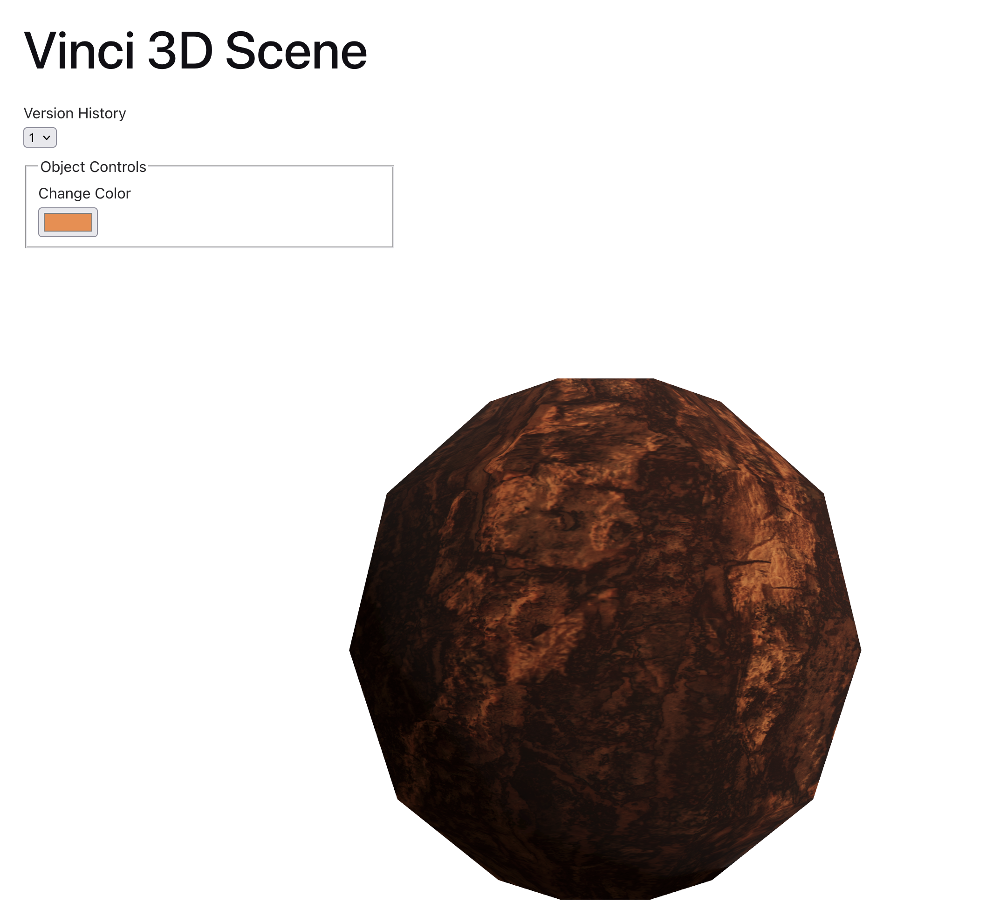

# Vinci3D Take Home Assignment

## Goals

My goal was do Option A: Interactive 3D Scene, and because October was just starting I thought I'd make a pumpkin (which didn't exactly work out).

## Decisions

Being completely new to three.js and a lot of the language surrounding its logic, I was trying not to keep it as simple as I could while still satisfying the project requirements.

- I chose the Vite Framework because Next.js felt like overkill for a simple one page example
- I decided to go with a basic object and wanted to make a pumpkin (I was way to optimistic initially)
- I decided to to pull in a texture that would help it look less like a ball, but couldn't quickly find any free textures that were what I wanted and settled on bark

When considering manipulations, I chose:

- Appearance
  - considered doing something easy for the change like clicking the item to change the color, but ultimately thought it’d be a better user experience if the user could choose the color, and also wanted to leave the click interaction open for other manipulations

And I was investigating these manipulations when I ran out of time:

- Sectioning/Slicing
- Interaction
  - I didn't want to just click and change the color, or highlight it because it'd be too much like the manipulation option I already had, so I was looking at doing a hover tooltip with the information

For the version history I thought about having a separate state property for the pumpkin but figured it could get out of sync with the history and if we’re already storing that state there, then there’s no reason to have a 2nd copy, for the sake of quickness and simplicity in this, but in a production app I’d likely do this differently.

- For the ability to go back and visualize the older version, I thought about a dropdown to select the different versions, so you could look through your changes, but then questions arose about how to handle further manipulations. If you’re viewing an older version should you disable the manipulation controls? Or if you’re viewing an older version and you make changes while doing so, does it progress from there and wipe out the newer versions that came after that one? That involves a lot of product decisions. I also considered an undo and redo button, which might be simpler because they carry more intent when switching “versions”, but that adds a bunch more tracking to the state.

What I ended up going with was the dropdown, and if you aren't viewing the most recent version then it disables the appearance controls, which was a trade-off since I didn't have the time to write a more complex state management system for it.

## How to Run

1. Clone the repo
2. Run `npm install` to install the packages
3. Run `npm run dev` to start the local dev server

## What I'd tackle next / What's Incomplete

I wasn't able to complete all the requirements in the 4 - 6 hour time box because I spent too much time trying to get the scene set up properly and making adjustments, troubleshooting three.js, etc.

Incomplete:

- Needs tests
- Needs 2 more manipulations
- Needs performance optimizations

So what I'd tackle next are those things, as well as something specific to the manipulation that I did add:

- Need a debounce on color selection

## Screenshot

